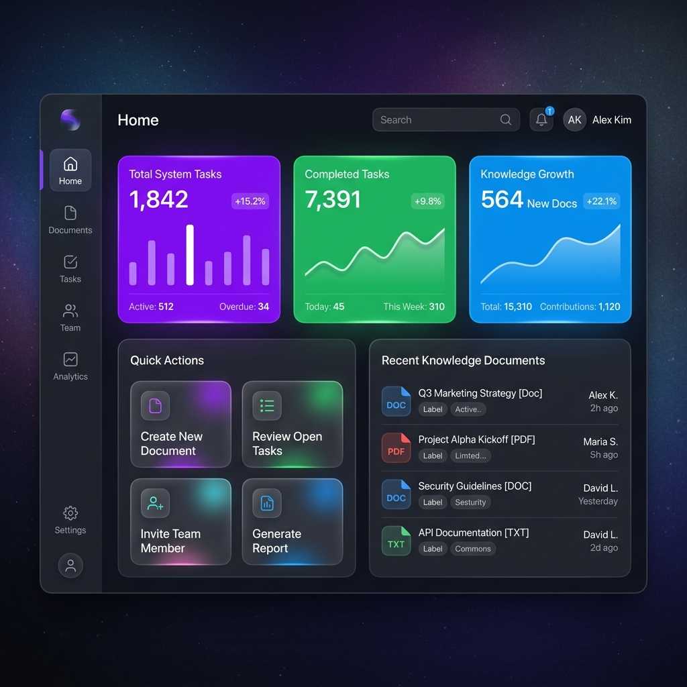
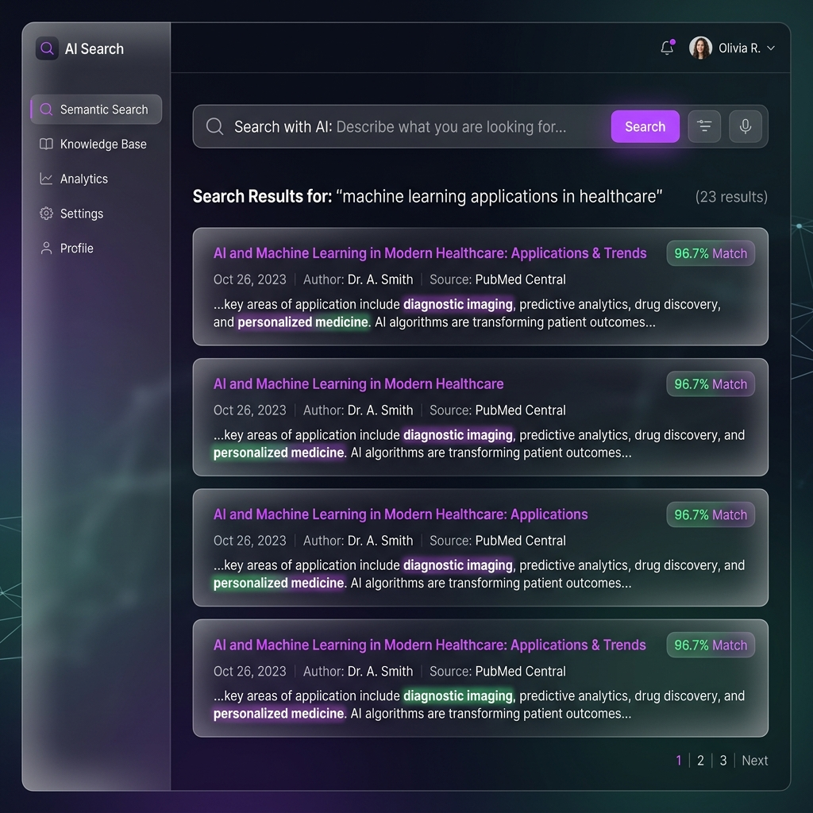
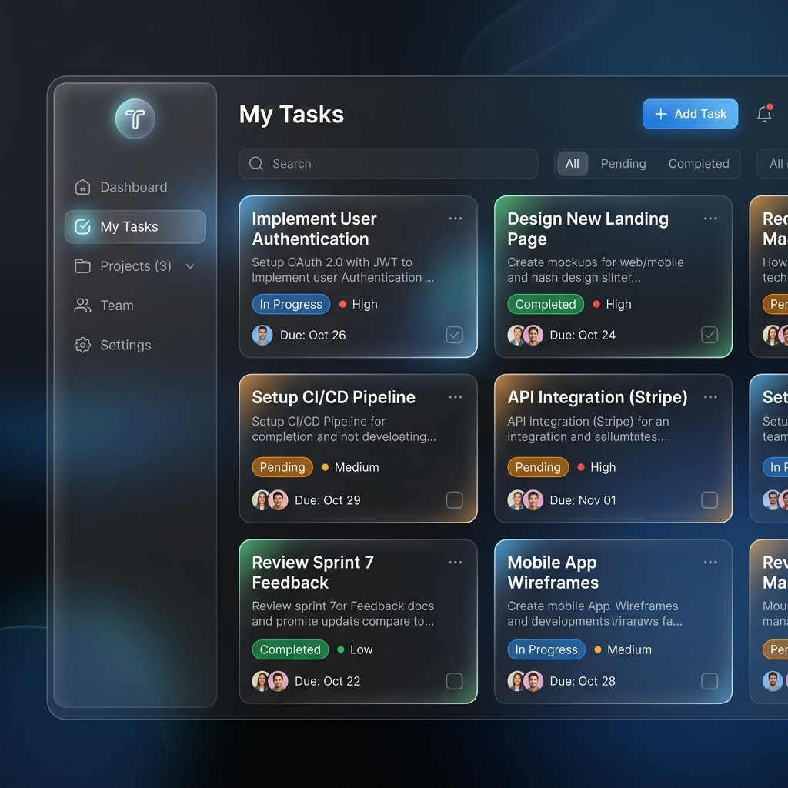

# KnowledgeFlow AI 🚀

**KnowledgeFlow AI** is a state-of-the-art, AI-powered Task & Knowledge Management Platform. Designed for seamless team collaboration, it integrates a powerful semantic search engine that understands the context of your uploaded documents—allowing you to search by meaning rather than just exact keywords.

Whether you are managing complex project tasks or building a centralized knowledge base, KnowledgeFlow AI ensures that your team always has the right information at their fingertips.

## ✨ Key Features & Technologies

- **High-Performance Backend**: Built with [FastAPI](https://fastapi.tiangolo.com/) for lightning-fast, asynchronous API routing.
- **Modern Responsive Frontend**: A stunning [React](https://reactjs.org/) SPA bundled with Vite, featuring a glassmorphism UI, dynamic dark mode, and a fully responsive collapsible sidebar.
- **Relational Database Architecture**: Uses [MySQL](https://www.mysql.com/) as the primary datastore, elegantly managed by SQLAlchemy ORM and Alembic migrations.
- **AI Semantic Search (Core Feature)**: Powered locally by [FAISS](https://github.com/facebookresearch/faiss) and Hugging Face's [SentenceTransformers](https://sbert.net/). It chunks, embeds, and indexes your documents entirely on your own hardware without relying on expensive external LLM APIs.
- **Robust Security**: JWT-based authentication ensures secure session management.
- **Role-Based Access Control (RBAC)**: Strict separation of concerns. *Admins* have the power to upload knowledge documents and assign tasks, while *Users* focus on execution and searching.
- **Actionable Analytics**: Real-time insight tracking for system tasks, search trends, and document metrics.

---

## 📸 Application Previews

### Dashboard & Analytics
Get an immediate overview of your entire workspace, pending tasks, and recent knowledge uploads.


### Semantic AI Search
Search your entire knowledge base intuitively. The AI highlights the best contextual matches even if your query doesn't share exact keywords.


### Task Management
A clean, dynamically filtered view to assign, track, and complete tasks seamlessly.


---

## 🛠️ Local Development Setup

### 1. Database & Backend
1. Clone the repository to your local machine.
2. Make sure you have **MySQL** installed and running on port 3306. 
3. Copy the `.env.example` file to `backend/.env` and update `DATABASE_URL` with your local MySQL credentials.
4. Navigate into the `backend/` directory.
5. Create a Python virtual environment and install the dependencies:
   ```bash
   python -m venv venv
   source venv/bin/activate  # On Windows use: venv\Scripts\activate
   pip install -r requirements.txt
   ```
6. Run Alembic migrations to automatically construct the relational database schema:
   ```bash
   alembic upgrade head
   ```
7. Start the FastAPI backend server:
   ```bash
   python -m uvicorn app.main:app --host 0.0.0.0 --port 8000 --reload
   ```
   *(You can explore the interactive API documentation at `http://localhost:8000/docs`)*

### 2. Frontend
1. Open a new terminal and navigate to the `frontend/` directory.
2. Install the necessary Node dependencies:
   ```bash
   npm install
   ```
3. Start the Vite development server:
   ```bash
   npm run dev
   ```
   *(View the beautiful web app at `http://localhost:5173/`)*

## 🤝 Contributing
Contributions, issues, and feature requests are welcome! Feel free to check the issues page.
